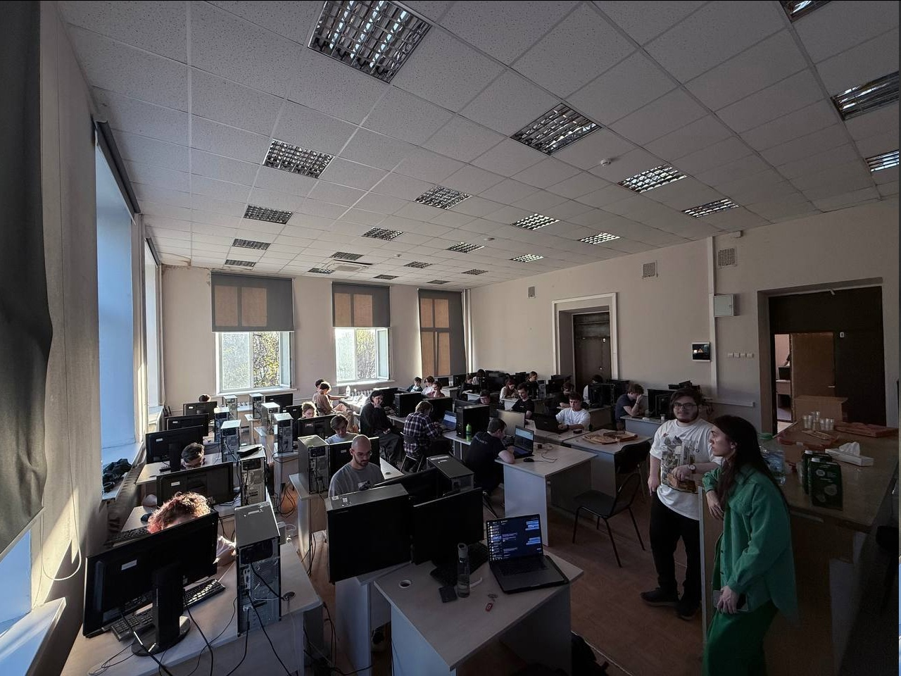

## Взаимодействие с партнером
В рамках взаимодействия с партнерами Московского Политеха было посещено проведенное 19.04.25 в Университете Яндексом мероприятие "Баттл Вузов", на котором участники должны были соревноваться друг с другом в написании кода для задач на скорость. После соревнования была проведена лекция от сотрудников Яндекса - бывших студентов Московского Политеха, рассказывающая о том, как работают продукты компании (в частности, беспилотные системы). 

