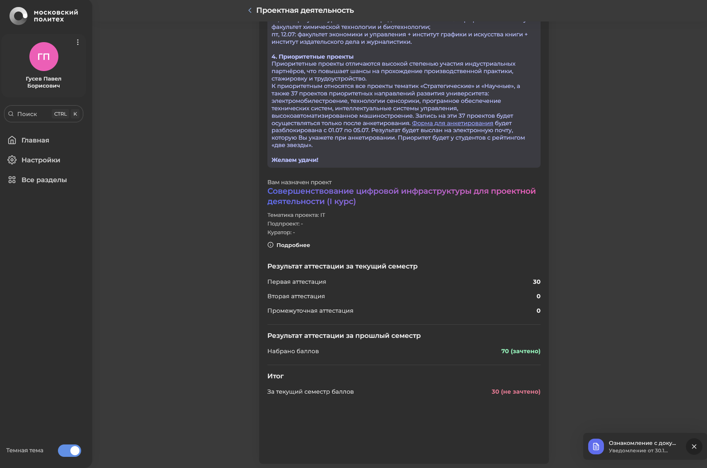
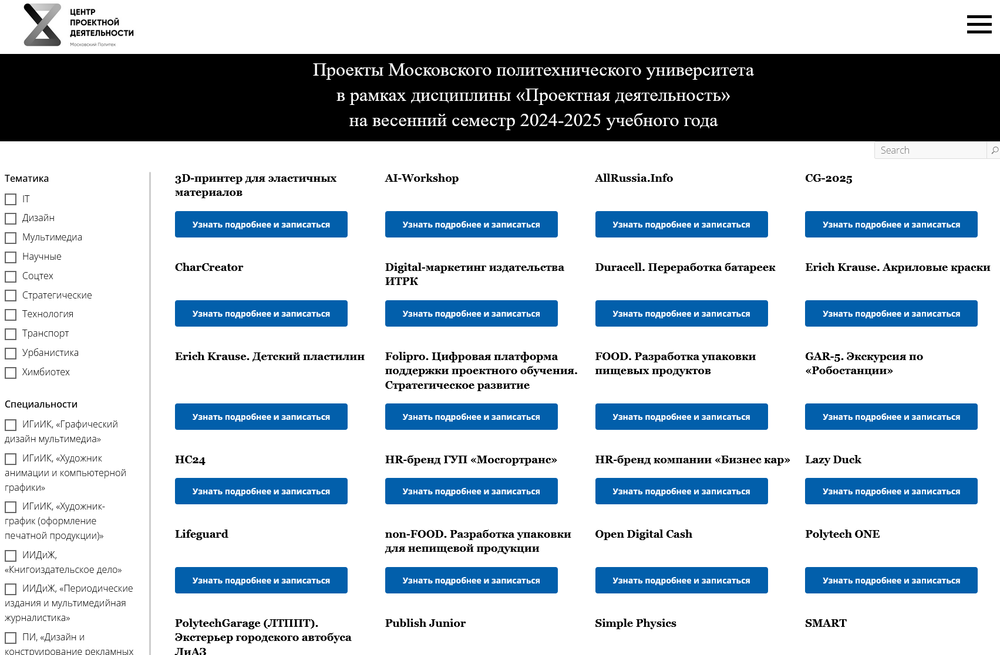

+++
title = 'О Проекте'
date = 2023-01-01T08:00:00-07:00
draft = false
+++
## Проект "Совершенствование цифровой инфраструктуры для проектной деятельности Московского Политеха"

---

### Описание
Целью данного проекта является улучшение и модернизация цифровой
инфраструктуры проектной деятельности университета; расширение функциональных
возможностей цифровых сервисов.
Сутью данного проекта является анализ цифровых сервисов проектной деятельности Московского Политеха, выявление их недостатков и, по возможности, их устранение; оптимизация и добавление нового функционала, улучшение и модернизация цифровой инфраструктуры проектной деятельности университета; расширение функциональных возможностей цифровых сервисов.

### Задачи
Опираясь на цель и проблематику проекта, поставлены следующие задачи:
- Анализ цифровой инфраструктуры проектной деятельности Московского Политеха - Выявление существующих проблем в цифровых сервисах проектной деятельности Московского Политеха 
- Поиск и реализация путей модернизации и улучшения функционала цифровых сервисов Московского Политеха — Поиск и реализация методов решения выявленных проблем.
- Разработка дизайнов сервисов проектной деятельности с добавленным функционалом для их дальнейшего внедрения. — Разработка дизайнов пользовательских интерфейсов для ряда сервисов цифровой инфраструктуры проектной деятельности как одно из решений выявленных проблем.

### Реализация
Поставленные задачи планируется реализовать следующим способом:
1. Анализ системы выбора студентами проектов по дисциплине “Проектная деятельность”

2. Поставка задач, которые должны привести к улучшению системы выбора проектов, исходя из навыков каждого студента.

3. Разработка нового дизайна личного кабинета куратора проекта

4. Разработка прототипа конечного результата деятельности проекта в Figma под контролем преподавателя

5. Разработка пояснительной записки и презентации результатов деятельности проекта 

Описание полученных результатов выполненных задач:

• Проведённый анализ цифровой инфраструктуры проектной деятельности позволил выявить все существующие на данный момент её недостатки.

• Найденные недостатки позволили проанализировать сервисы, решающие поставленные проблемы.
### Выявленные проблемы и пути их решения
В ходе анализа цифровых сервисов были выявлены следующие проблемы, требующие решения, вместе с наиболее приемлемыми методами их решения:

**Отсутствие удобного доступа к информации в личном кабинете**: При попытке
перейти по гиперссылке информация о проекте не загружается, что затрудняет работу с
платформой. Данную проблему можно решить модифицировав исходный код сайта и
добавив таким образом возможность корректно отображать информацию о проекте.
Возможно, придётся также изменить и базу данных, отвечающую за хранение
информации о проектах.

**Проблемы с доступностью выбора проекта в новом дизайне**: Функция выбора
проекта и возможность подать заявку на собственный проект пока не интегрированы в
обновлённый интерфейс, что снижает удобство использования системы.

На данный проект раздел "Проектная деятельность" ЛК Московского Политеха выглядит так: 

Данную
проблему можно решить модифицировав исходный код сайта и тем самым интегрировав
функцию выбора проекта в новом интерфейсе. За основу можно взять исходный код
функции выбора проекта из старой версии интерфейса.

**Неудобный интерфейс витрины проектов на сайте Центра Проектной
деятельности**: Сами проекты не разделены никакой физической границей, из-за чего
студент не сразу догадывается, к какому конкретно проекту относится та или иная
кнопка «Узнать подробнее и записаться», фильтры по направлениям и специальностям
расположены слева и представлены в виде флажков с текстом, которые слабо выделяются
на фоне общего текста и никак не выделяются при наведении на них курсора, поэтому
при первом взгляде пользователь может спутать их с обычным текстом.

На видео ниже показаны текущие интерфейсы ЛК Студента и ЦПД с демонстрацией взаимодействия пользователя с ним, подчёркивающей их недостатки

<video width="765" controls>
  <source src="44.mp4" type="video/mp4">
</video>

---

Данный проект затрагивает злободневную тему, в определённый момент
касающуюся каждого студента – проблему выбора проекта, который, с одной стороны,
ему интересен, а с другой – где будут востребованы именно его навыки. Эту задачу
призваны решать цифровые сервисы нашего института, но, как и любые цифровые
платформы, требуют постоянных обновлений и модернизации. Данный проект отлично
отвечает этим требованиям.

---
